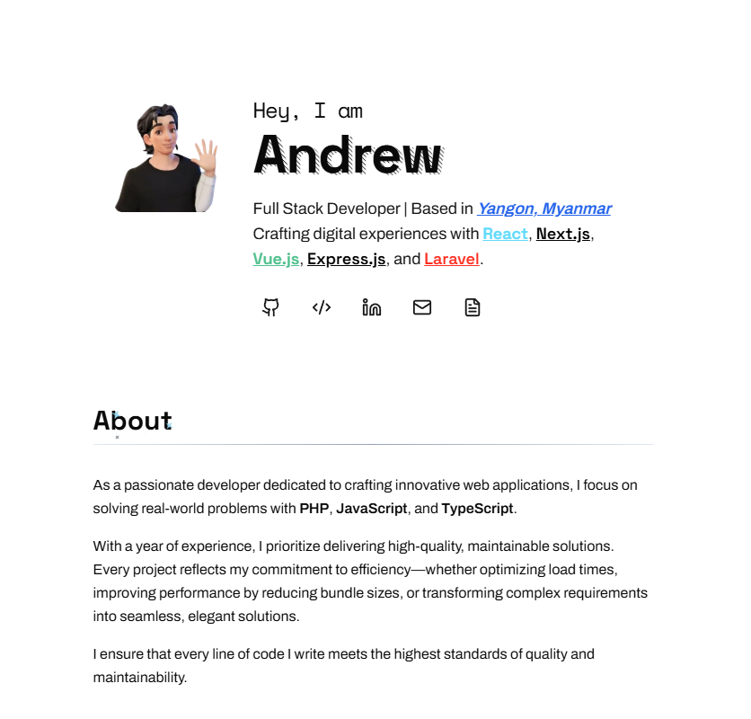

# Andrew's Developer Portfolio

 <!-- Add your screenshot here -->

A modern developer portfolio built with Next.js 15 showcasing cutting-edge web development practices. This project demonstrates proficiency in React ecosystem tools and modern UI patterns.

## ✨ Key Features

### Core Functionality
- **Dynamic Project Showcase** with Zustand state management for filtered displays  
- **Animated Transitions** using Framer Motion for smooth UI interactions  
- **Theme System** supporting dark/light modes with `next-themes` integration  
- **Contact Form** with Resend email API integration  

### Technical Highlights
- ⚡ **Static Site Generation** with Next.js 15 App Router  
- 🎨 **Tailwind CSS** with custom animations and dark mode configuration  
- 🔄 **Client-Side State Management** using Zustand stores  
- 📧 **Type-Safe API Routes** for email functionality  

## 🛠 Tech Stack

| Category              | Technologies                                                                 |
|-----------------------|-----------------------------------------------------------------------------|
| **Core Framework**    | Next.js 15.1.7 + React 19 + TypeScript 5                                    |
| **Styling**           | Tailwind CSS 3.4.1 + Radix UI Primitives                                    |
| **State Management**  | Zustand 5.0.4 + URL-based project filtering                                 |
| **Form Handling**     | React Hook Form 7.54.2 + Zod validation                                    |
| **Animations**        | Framer Motion 12.4.7 + CSS keyframes                                       |
| **Infrastructure**    | Vercel Analytics + Resend Email API                                         |

